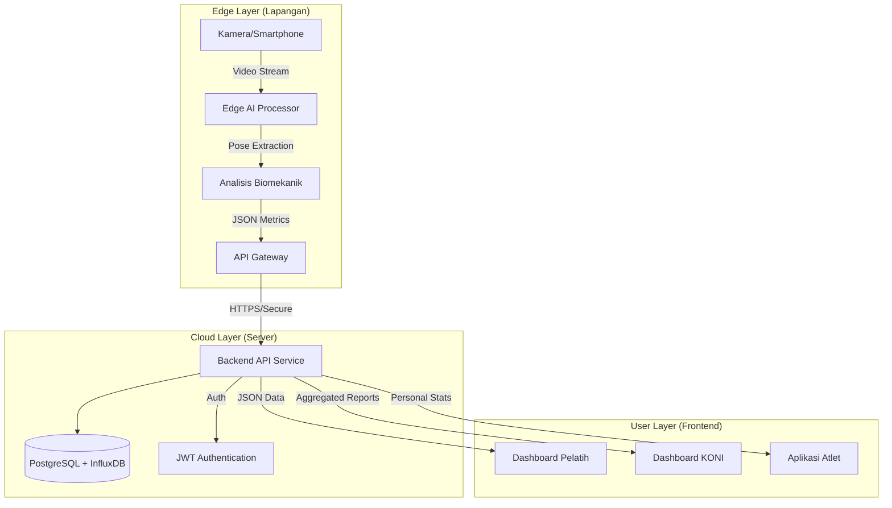

# Rencana Pengembangan: Smart Sprint Training System (SSTS) Berbasis AI

Dokumen ini merincikan rencana pengembangan sistem cerdas lintas platform untuk pelatihan atlet sprint 100 meter, sesuai dengan kebutuhan KONI dan standar modern pengembangan perangkat lunak (AI, Cloud, IoT).

## 1. Ringkasan Eksekutif
Sistem ini bertujuan untuk mendigitalisasi dan meningkatkan kualitas pelatihan atlet sprint melalui analisis biomekanik berbasis AI. Data diambil dari kamera (Edge), diproses untuk mengekstrak metrik kunci (waktu, stride, cadence), dan disajikan melalui dashboard web untuk pelatih (mikro) dan manajemen KONI (makro).

## 2. Arsitektur Sistem (High-Level)

Sistem menggunakan arsitektur **Hybrid Edge-Cloud**.
- **Edge (Lokasi Latihan)**: Memproses video real-time untuk ekstraksi data mentah (privasi & bandwidth efisiensi).
- **Cloud (Server)**: Menyimpan data historis, manajemen user, dan analisis agregat.

## 3. Technology Stack

Dipilih berdasarkan performa, skalabilitas, dan kompatibilitas dengan ekosistem AI Python.

| Komponen | Teknologi | Alasan Pemilihan |
| :--- | :--- | :--- |
| **Edge AI** | **Python, MediaPipe, OpenCV** | Core AI yang sudah ada, performa tinggi untuk pose estimation. |
| **Backend API** | **FastAPI (Python)** | Asynchronous, sangat cepat, integrasi native dengan library AI Python. |
| **Database Relasional** | **PostgreSQL** | Standar industri untuk data user, profil atlet, dan relasi logis. |
| **DB Time-Series** | **TimescaleDB / InfluxDB** | (Opsional) Menyimpan data telemetri sudut sendi per frame untuk analisis mendalam. |
| **Frontend Web** | **React.js (Vite)** | Komponen modular, ekosistem visualisasi data yang kaya (Recharts/Chart.js). |
| **Dashboard Analytics**| **Grafana** (Opsional) | Untuk visualisasi data time-series performa yang kompleks bagi KONI. |
| **Mobile App** | **React Native** | Codebase bisa dibagi dengan Web React, efisiensi development. |
| **Security** | **JWT, bcrypt, SSL/TLS** | Standar keamanan modern untuk autentikasi dan transmisi data. |

## 4. Rincian Fitur & Modul

### A. Komponen AI (Edge Processing)
Memanfaatkan kode yang sudah ada dengan peningkatan:
- **Input**: Video 100fps (ideal) atau 60fps.
- **Processing**:
  1. **Pose Estimation**: Ekstraksi 33 keypoints tubuh.
  2. **Event Detection**: Deteksi fase Start (reaksi), Drive Phase (akselerasi), dan Max Velocity.
  3. **Biomechanical Calculation**: Menghitung sudut lutut, ekstensi panggul, trunk angle.
- **Output**: File JSON berisi time-series data sudut dan ringkasan metrik (Split time, Cadence).

### B. Dashboard Pelatih (Web - React)
Fokus pada analisis mikro per atlet.
- **Timeline Latihan**: Kalender sesi latihan.
- **Video Analysis**: Pemutar video dengan overlay stickman dan grafik sinkron.
- **Comparison**: Membandingkan 2 video (misal: Sesi hari ini vs Personal Best).
- **AI Feedback**: Alert otomatis "Warning: Knee Drive too low at 30m".

### C. Dashboard Manajemen KONI (Web/Grafana)
Fokus pada analisis makro dan monitoring program.
- **Talent Mapping**: Grafik sebaran performa atlet per daerah/klub.
- **Progress Tracking**: Tren peningkatan rata-rata kecepatan atlet binaan.
- **Injury Monitor**: Statistik pelaporan cedera/absensi latihan.

## 5. Model Data & Metrik
Data yang dikumpulkan dan disimpan:

1. **Atribut Atlet**: Nama, Usia, Tinggi, Berat, PB (Personal Best).
2. **Sesi Latihan**: Tanggal, Lokasi, Cuaca.
3. **Metrik Performa (Run Data)**:
   - **Waktu Total**: 100m time.
   - **Split Times**: 0-30m (Start), 30-60m (Drive), 60-100m (Endurance).
   - **Top Speed**: Kecepatan puncak (km/h).
   - **Avg Cadence**: Langkah per menit.
   - **Avg Stride Length**: Panjang langkah rata-rata.
   - **Form Score (0-100)**: Dinilai berdasarkan kesesuaian sudut sendi ideal.

## 6. Strategi Keamanan (Security)

1. **Authentication (AuthN)**:
   - Menggunakan **JWT (JSON Web Tokens)** dengan masa berlaku pendek + Refresh Token.
   - Password di-hash menggunakan **bcrypt** sebelum masuk database.

2. **Authorization (AuthZ)**:
   - **Role-Based Access Control (RBAC)**:
     - `ROLE_ATHLETE`: Hanya bisa melihat data sendiri.
     - `ROLE_COACH`: Bisa melihat/edit data atlet di bawah bimbingannya.
     - `ROLE_ADMIN/KONI`: Akses read-only ke semua data agregat, akses full manajemen user.

3. **Data Protection**:
   - Komunikasi Client-Server wajib via **HTTPS**.
   - Data sensitif (medis/cedera) dienkripsi di level kolom database (AES-256).

## 7. Roadmap Implementasi

### Fase 1: Inisialisasi & Backend Core (Minggu 1-2)
- Setup Repositori Git & Lingkungan Dev.
- Desain Skema Database (PostgreSQL).
- Implementasi API Dasar (Login, CRUD User, CRUD Sesi) dengan FastAPI.

### Fase 2: Adaptasi Edge AI (Minggu 2-3)
- Modifikasi skrip Python (Edge) untuk mengirim data ke API alih-alih hanya tampil di layar.
- Implementasi algoritma deteksi "Split Time" otomatis berdasarkan jarak virtual/marker.

### Fase 3: Frontend Dashboard (Minggu 3-5)
- Setup React Project.
- Pembuatan UI Login & Dashboard Utama.
- Integrasi Library Charting untuk visualisasi data gait.

### Fase 4: Integrasi & Testing (Minggu 6)
- Pengujian aliran data ujung-ke-ujung (Camera -> Dashboard).
- Load testing dan Security Audit (Penetration Test sederhana pada API).
- Dokumentasi & Training User.

---
**Status Dokumen**: Draft Rencana Pengembangan v1.0
**Disiapkan oleh**: Assistant AI & Tim Pengembang
